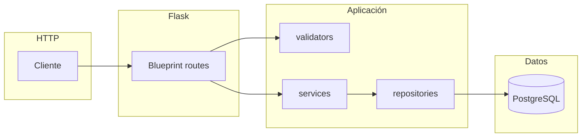

# Guías para APIs REST en Flask (monorepo)

Este documento fija los estándares para servicios HTTP implementados con **Flask** dentro de `sources/apis/`. El ejemplo canónico del repositorio es **[DataVerificationCleanner](../../sources/apis/DataVerificationCleanner/)**. Otros backends (por ejemplo el dashboard) pueden usar otro framework; estas normas aplican solo a servicios Flask.

Los contratos entre componentes del pipeline y el envelope JSON están definidos en **[api-contracts.md](../api-contracts.md)**. La especificación formal complementaria vive en **[openapi.json](../openapi.json)**.

---

## 1. Stack y versiones

- **Flask** 3.x como framework web.
- **flask-cors** para CORS cuando el cliente sea otro origen (navegador u otro servicio).
- **python-dotenv** + clase de configuración que lee variables de entorno.
- Dependencias listadas por servicio (p. ej. `requirements.txt` en la raíz del proyecto del API).
- Versiones de Python: alinear con el proyecto (p. ej. `requires-python` o `.python-version` si existe en el repo).

Referencia: [requirements.txt](../../sources/apis/DataVerificationCleanner/requirements.txt).

---

## 2. Estructura de proyecto recomendada

Organización alineada con el servicio de verificación:

| Ruta | Rol |
|------|-----|
| `app.py` | Factory `create_app()`, registro de blueprints, `/health`, manejadores globales de error |
| `config.py` | Clase `Config` (o equivalente) cargada con `app.config.from_object()` |
| `db.py` | Solo si hay PostgreSQL: pool (`psycopg2`), `get_connection()` y cierre seguro |
| `routes/` | Blueprints por dominio; `validators.py` para reglas de body/query |
| `services/` | Orquestación de negocio; integración con APIs externas; **no** SQL directo salvo excepción justificada |
| `repositories/` | Consultas e inserciones a la base de datos |
| `lib/` | Librerías internas reutilizables (p. ej. pipelines) |
| `config/` | YAML/JSON de comportamiento no secreto (flags, rutas de pipeline) |
| `.env.example` | Plantilla de variables **sin** secretos reales |

Detalle de árbol: [README del servicio](../../sources/apis/DataVerificationCleanner/README.md).

---

## 3. Rutas y versionado

- Prefijo de API: **`/api/v1/<dominio>`**, donde `<dominio>` coincide con el contrato (p. ej. `verificacion`, `sentimiento`, `dashboard`).
- Un **Blueprint** por dominio lógico, con `url_prefix` explícito:

```python
verificacion_bp = Blueprint("verificacion", __name__, url_prefix="/api/v1/verificacion")
```

- **Health check** fuera del prefijo versionado, en **`GET /health`**, con JSON que identifique servicio y versión (como en [app.py](../../sources/apis/DataVerificationCleanner/app.py)).

---

## 4. Contrato JSON (envelope)

Todas las respuestas JSON de negocio deben seguir el envelope acordado en [api-contracts.md](../api-contracts.md):

```json
{
  "ok": true,
  "data": { },
  "error": null
}
```

```json
{
  "ok": false,
  "data": null,
  "error": {
    "codigo": "CODIGO_EN_MAYUSCULAS_SNAKE",
    "mensaje": "Texto legible para el cliente o logs"
  }
}
```

Normas:

- **`codigo`**: identificador estable en `UPPER_SNAKE_CASE`, documentado en el contrato cuando sea parte del API público.
- **Errores 500**: mensaje genérico al cliente; detalles técnicos solo en logs, no en el cuerpo de respuesta.
- Helpers locales `ok(data)` y `error(codigo, mensaje, status=...)` mantienen consistencia (ver [verificacion.py](../../sources/apis/DataVerificationCleanner/routes/verificacion.py)).

---

## 5. Códigos HTTP

Mapear el fallo al status más expresivo, alineado con la implementación actual:

| Situación | HTTP sugerido |
|-----------|----------------|
| Body inválido o validación de entrada | `400` |
| Recurso no encontrado (incl. externos como Drive cuando aplique) | `404` |
| Conflicto de negocio (p. ej. recurso ya procesado) | `409` |
| Contenido no procesable (CSV, estructura, reglas de dominio) | `422` |
| Error interno genérico | `500` |
| Fallo de integración aguas arriba / red (p. ej. API externa) | `502` |
| Servicio externo no disponible o credenciales inválidas en integración | `503` |

Los manejadores globales en `app.py` deben devolver el mismo envelope para `404`, `405` y `500` cuando no exista una ruta específica.

---

## 6. Capas y responsabilidades



- **Rutas**: parsear `request`, validar con `validators`, llamar a `services` / `repositories`, traducir excepciones de dominio a `error(...)` con el código HTTP adecuado.
- **Services**: reglas de negocio y llamadas a sistemas externos; lanzar excepciones definidas en [services/exceptions.py](../../sources/apis/DataVerificationCleanner/services/exceptions.py) (o equivalente por servicio).
- **Repositories**: SQL y mapeo fila ↔ dict/objeto; aceptar `conn` opcional para participar en la misma transacción.
- **No** propagar detalles de `psycopg2` o SDKs externos como respuesta JSON; capturar en la ruta o en la capa de servicio y convertir a excepciones de dominio o a `error(...)`.

---

## 7. Validación

- Reglas reutilizables en **`routes/validators.py`** (o módulos por recurso).
- Funciones que devuelven **lista de mensajes de error**; lista vacía = válido (patrón en [validators.py](../../sources/apis/DataVerificationCleanner/routes/validators.py)).
- Para body JSON ausente o vacío, responder con código tipo **`BODY_INVALIDO`** y `400`.

---

## 8. Base de datos

Si el servicio usa PostgreSQL:

- Inicializar el pool una sola vez en `create_app()` (ver [db.py](../../sources/apis/DataVerificationCleanner/db.py)).
- Usar `with get_connection() as conn:` para commits/rollbacks automáticos.
- Para varias escrituras atómicas, una sola conexión en el `with` y pasar `conn` a los repositorios.

---

## 9. Observabilidad

- `logging.getLogger(__name__)` por módulo; niveles `info` para hitos, `warning` para recuperables, `error` para fallos.
- Encima de cada vista, bloque de comentario con **método**, **ruta**, **body o query** y propósito (como en [verificacion.py](../../sources/apis/DataVerificationCleanner/routes/verificacion.py)).

---

## 10. Seguridad y configuración

- Secretos y URLs de BD solo por variables de entorno; documentar claves en **`.env.example`** sin valores reales.
- Respetar los headers globales descritos en [api-contracts.md](../api-contracts.md) (`Content-Type`, `Authorization`, etc.) cuando el contrato los exija.
- `SECRET_KEY` y credenciales de cuentas de servicio **nunca** en el repositorio.

---

## 11. Coherencia con OpenAPI

Al añadir o cambiar endpoints expuestos a otros equipos o al dashboard, actualizar **[openapi.json](../openapi.json)** y, cuando aplique, [api-contracts.md](../api-contracts.md).

---

## Referencias rápidas

| Tema | Archivo |
|------|---------|
| Factory, CORS, health, error handlers | [app.py](../../sources/apis/DataVerificationCleanner/app.py) |
| Configuración | [config.py](../../sources/apis/DataVerificationCleanner/config.py) |
| Blueprint, `ok`/`error` | [routes/verificacion.py](../../sources/apis/DataVerificationCleanner/routes/verificacion.py) |
| Validadores | [routes/validators.py](../../sources/apis/DataVerificationCleanner/routes/validators.py) |
| Pool y conexiones | [db.py](../../sources/apis/DataVerificationCleanner/db.py) |
| Excepciones de dominio | [services/exceptions.py](../../sources/apis/DataVerificationCleanner/services/exceptions.py) |

Para pasos operativos (crear servicio, añadir endpoint, checklist), ver **[instructions.md](instructions.md)**.
