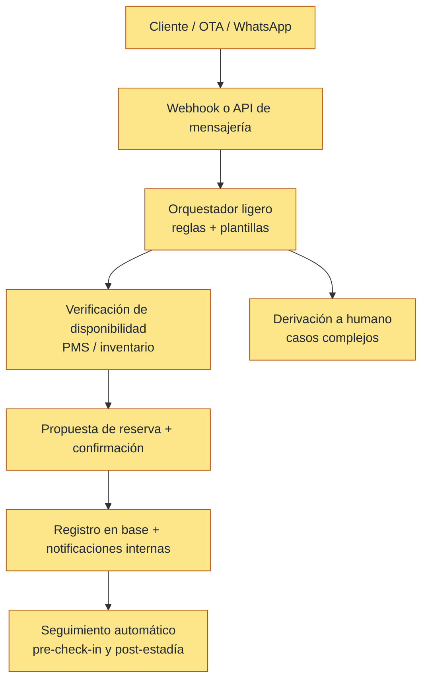

# 🏨 Sistema Inteligente de Análisis de Sentimiento y Recomendaciones
**Optimización de Experiencia en el Sector Hotelero**

## 📌 Descripción del Proyecto

Este proyecto tiene como objetivo transformar la gestión operativa y estratégica del hotel mediante la automatización de indicadores clave (KPIs), análisis de emociones en reseñas y mensajes de clientes, y la implementación de un sistema recomendador inteligente.

La iniciativa evoluciona en tres fases:

- 🔵 Inteligencia Interna
- 🟣 Sistema Recomendador
- 🟢 Agente Inteligente de Reservas

El enfoque es escalable, de bajo costo y orientado a impacto real en reputación, ingresos y experiencia del huésped.

## 📁 Estructura del repositorio

| Carpeta | Contenido |
| --- | --- |
| **[`Fase-I/`](Fase-I/)** | Implementación de **Fase 1 – Inteligencia interna**: microservicios (ingesta, sentimiento, ABSA, métricas, API de dashboard), front Next.js, notebooks, guidelines y documentación técnica. Ver [`Fase-I/README.md`](Fase-I/README.md). |
| **Raíz (`README.md`)** | Visión del programa completo (Fases 0–3), cronograma e impacto estratégico. |

## 🟡 Fase 0 – Automatización Operativa (Transversal)

Esta etapa acompaña todo el proyecto y habilita automatizaciones desde la reserva hasta la atención post‑estadía, incluyendo un agente ligero conectado a WhatsApp Business.

### Alcance

- Captura y normalización de solicitudes de reserva.
- Respuestas automáticas iniciales y recolección de datos básicos.
- Confirmación y actualización de reservas.
- Derivación a humano ante casos complejos.

### Flujo operativo (Fase 0)



## 🎯 Objetivos Estratégicos

- Automatizar el análisis de reseñas y mensajes.
- Medir en tiempo real indicadores de reputación.
- Detectar alertas tempranas de posibles crisis.
- Personalizar la oferta de servicios.
- Evolucionar hacia un agente autónomo de reservas.

## 🏗 Arquitectura General

Plataformas (Google, Booking, Airbnb)

WhatsApp Business
↓
Pipeline de datos (Python + NLP)
↓
Base estructurada
↓
Dashboard ejecutivo + Sistema de alertas
↓
Motor de recomendación
↓
Agente inteligente (Fase 3)

## 🔵 Fase 1 – Inteligencia Interna

> **Código y documentación operativa:** carpeta [`Fase-I/`](Fase-I/) — guía completa en [`Fase-I/README.md`](Fase-I/README.md).

### Alcance

- Consolidación automática de datos.
- Análisis de sentimiento y emociones.
- Identificación de tópicos críticos (ABSA).
- Automatización de KPIs.
- Dashboard ejecutivo.
- Sistema de alertas tempranas.
- MLOps y experimentación en notebooks.

### Implementación en `Fase-I/` (resumen)

Pipeline de microservicios orquestado (p. ej. scheduler o n8n), según [`Fase-I/guidelines/api-contracts.md`](Fase-I/guidelines/api-contracts.md):

```
Azure Blob (CSV) → Data Verification & Cleaner → Sentiment Prediction
    → ABSAService → MetricProcessor → Dashboard Backend → olh-sentiment-ia (Next.js)
```

| Componente | Rol |
| --- | --- |
| **Data Verification & Cleaner** | Ingesta, validación y limpieza hacia PostgreSQL |
| **Sentiment Prediction** | Inferencia de sentimiento (BERT) |
| **ABSAService** | Sentimiento por aspectos / tópicos (`review_topicos`) |
| **MetricProcessor** | Cálculo batch de KPIs agregados |
| **Dashboard Backend** | API de lectura para el front |
| **olh-sentiment-ia** | Dashboard y administración de archivos de entrada |

Otros artefactos: **`Fase-I/notebooks/`** (EDA, ABSA, scraping), **`Fase-I/pipeline/`** (diagrama interactivo del flujo), **`Fase-I/Poc/`** (POC estático), **`Fase-I/guidelines/`** (DDL, OpenAPI, contratos REST, KPIs).

**Stack (Fase 1):** Python · Flask · PostgreSQL (p. ej. Neon) · Azure Blob · Next.js · Transformers/BERT · LLM/OpenAI Batch para ABSA.

### KPIs Clave

- Sentimiento promedio y evolución en el tiempo.
- Reviews analizadas y tópicos con alerta.
- Score por tópico y top críticos.
- Rating promedio e Índice de Experiencia Inteligente (IEI), según reglas en `Fase-I/guidelines/`.

## 🟣 Fase 2 – Sistema Recomendador

### Alcance

- Segmentación automática de huéspedes.
- Motor de reglas de recomendación.
- Personalización de ofertas.
- Integración con comunicación (WhatsApp).
- Medición de aceptación y conversión.

### Métricas

- CTR de recomendaciones.
- Tasa de conversión.
- Incremento en ventas cruzadas.
- Recompra.

## 🟢 Fase 3 – Agente Inteligente de Reservas

### Alcance

- Gestión automática de reservas.
- Respuestas inteligentes en WhatsApp.
- Detección de intención.
- Sugerencias personalizadas en tiempo real.
- Integración con sistema actual del hotel.

## 📊 Entregables

- Base de datos consolidada.
- Motor NLP operativo.
- Dashboard gerencial.
- Sistema de alertas.
- Recomendador funcional.
- Roadmap evolutivo.
- Documento técnico final.

## 💻 Tecnologías Propuestas

- Python
- NLP (transformers / modelos ligeros)
- Pandas
- Power BI o Looker Studio
- WhatsApp Business API
- SQLite / Base ligera
- Docker (opcional para despliegue)

## 📅 Cronograma

- Inicio: 16 febrero
- Horizonte: 16 semanas (febrero–junio)
- Finalización Fase 2: primera semana de junio
- Fase 3: evolutiva posterior (arranca en S13)

### Metodología Gantt (semanas S1–S16)

**Leyenda:** 🟨 Fase 0 · 🟦 Fase 1 · 🟪 Fase 2 · 🟩 Fase 3 · — sin actividad

| Actividad | S1 | S2 | S3 | S4 | S5 | S6 | S7 | S8 | S9 | S10 | S11 | S12 | S13 | S14 | S15 | S16 |
| --- | --- | --- | --- | --- | --- | --- | --- | --- | --- | --- | --- | --- | --- | --- | --- | --- |
| Fase 0 – Automatización operativa | 🟨 | 🟨 | 🟨 | 🟨 | 🟨 | 🟨 | 🟨 | 🟨 | 🟨 | 🟨 | 🟨 | 🟨 | 🟨 | 🟨 | 🟨 | 🟨 |
| Levantamiento + KPIs | 🟦 | 🟦 | — | — | — | — | — | — | — | — | — | — | — | — | — | — |
| Pipeline de datos | — | — | 🟦 | 🟦 | — | — | — | — | — | — | — | — | — | — | — | — |
| Análisis emocional | — | — | — | — | 🟦 | 🟦 | — | — | — | — | — | — | — | — | — | — |
| Alertas automáticas | — | — | — | — | — | — | 🟦 | — | — | — | — | — | — | — | — | — |
| Dashboard ejecutivo | — | — | — | — | — | — | — | 🟦 | — | — | — | — | — | — | — | — |
| Segmentación clientes | — | — | — | — | — | — | — | — | 🟪 | 🟪 | — | — | — | — | — | — |
| Motor recomendación | — | — | — | — | — | — | — | — | — | — | 🟪 | 🟪 | — | — | — | — |
| Integración comunicación | — | — | — | — | — | — | — | — | — | — | — | — | 🟪 | 🟪 | — | — |
| Métricas impacto | — | — | — | — | — | — | — | — | — | — | — | — | — | — | 🟪 | — |
| Diseño agente reservas | — | — | — | — | — | — | — | — | — | — | — | — | 🟩 | 🟩 | — | — |
| Integración WhatsApp IA | — | — | — | — | — | — | — | — | — | — | — | — | — | 🟩 | 🟩 | — |
| Pruebas piloto agente | — | — | — | — | — | — | — | — | — | — | — | — | — | — | 🟩 | — |
| Presentación final | — | — | — | — | — | — | — | — | — | — | — | — | — | — | — | 🟩 |

## 🚀 Impacto Esperado

- Mejora reputacional medible.
- Reducción de crisis.
- Toma de decisiones basada en datos.
- Personalización real del servicio.
- Base para transformación digital hotelera.

## 🧠 Visión

Evolucionar hacia un modelo de hotel inteligente donde la experiencia del huésped, la reputación y la operación estén conectadas mediante inteligencia artificial.

---

## ✨ Firma Estratégica

Proyecto diseñado para escalar de analítica operativa a inteligencia accionable, con foco en reputación, ingresos y experiencia del huésped.
